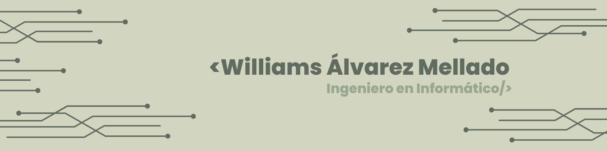

## Bienvenidos a mi GitHub👋

## Sobre mí 💻

✔ Estoy comprometido con mi desarrollo profesional, buscando constantemente mejorar tanto mis habilidades técnicas como blandas. 😊  
✔ Me educo de forma autodidacta, aprovechando recursos disponibles para adquirir y profundizar en conocimientos. 
✔ No me conformo solo con lo aprendido formalmente, sino que continúo practicando código y fortaleciendo mi lógica de programación día a día.😎 

## Certificados 💻
✔ JavaScript Moderno Guía Definitiva Construye +20 Proyectos - **Udemy**  
✔ Curso React y Next 14: Paso a paso y desde 0 (Full Stack JS) - **Udemy**  

## Tecnologias 💻
 **Front-end**
 

 **Back-end**

 **Softwares and Tools**

 

